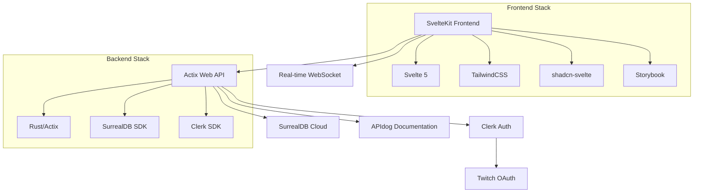

# La Liga de los Muertos (Monorepo)

[](https://github.com/TuentyFaiv/liga-muertos/actions)
[](https://codecov.io/gh/TuentyFaiv/liga-muertos)
[](https://github.com/TuentyFaiv/liga-muertos/graphs/contributors)
[](https://github.com/TuentyFaiv/liga-muertos/stargazers)
[](./LICENSE)

This repository contains the code for La Liga de los Muertos, a modern web platform for managing and viewing information about a streaming football league. The project is structured as a monorepo with both frontend and backend components.

## Project Structure

This repository is organized as a monorepo containing both frontend and backend components:

```
liga-muertos/
├── .github/              # GitHub templates and workflows
│   ├── GOOD_FIRST_ISSUES/    # Ready-to-use issue templates
│   ├── ISSUE_TEMPLATE/       # Issue form templates
│   ├── PULL_REQUEST_TEMPLATE/# PR template directory
│   ├── ANNOUNCEMENT.md       # Community announcement template
│   ├── LABELS.md            # GitHub labels guide
│   ├── NEWCOMERS.md         # Newcomer contributor guide
│   └── pull_request_template.md # Main PR template
├── front/                # Svelte/SvelteKit frontend application
├── back/                # Rust-based backend service
├── CODE_OF_CONDUCT.md   # Community standards and behavior
├── CONTRIBUTING.md      # Contribution guidelines and workflow
├── LICENSE             # MIT License
├── README.md          # This file
└── VISION.md          # Project vision and philosophy
```

## Frontend (front/)

The frontend is built with SvelteKit, providing a modern, responsive user interface.

Key technologies:
- Svelte 5 / SvelteKit 2
- TailwindCSS
- shadcn-svelte for UI components
- Storybook for component development
- Playwright and Vitest for testing
- Internationalization with Paraglide

See the [frontend README](./front/README.md) for detailed information.

## Backend (back/)

The backend is built with Rust, offering high performance and reliability.

Key technologies:
- Rust programming language
- Actix web framework
- SurrealDB Cloud for database
- Clerk for authentication (with Twitch integration)
- APIdog for API documentation

See the [backend README](./back/README.md) for detailed information.

## 🎯 Our Vision

La Liga de los Muertos represents a paradigm shift in streaming league management - built from the ground up for the streaming creator economy. Unlike existing solutions that treat streaming as an afterthought, we put streamers and their communities at the center of everything we build.

**Why we're different:**
- **Streaming-first design** with native Twitch integration
- **Community-driven development** with transparency and open source
- **Modern technology stack** built for performance and scalability
- **Mobile-optimized experience** for today's audiences

Read our complete [Project Vision](./VISION.md) to understand how we're revolutionizing tournament management for streamers.

## 🏷️ Project Management

This project is part of the **tuentyfaiv** brand ecosystem, focused on building tools for the streaming and gaming community.

### Tracking & Organization

- 📋 **Projects Board**: [Liga Muertos Projects](https://tuentyfaiv.notion.site/2567c18490bf813ea1c5dfade251a85d?v=2567c18490bf812ca027000c6f4e9bf2&p=2567c18490bf807eaadff15a78a20d03&pm=s) - High-level project tracking and milestones
- 📝 **Task Management**: [Development Tasks](https://tuentyfaiv.notion.site/2567c18490bf817c81f8eea2c8e0add2?v=2567c18490bf813c9449000c0d49f2ae) - Sprint planning and task tracking
- ✨ **Feature Requests**: [Feature Board](https://tuentyfaiv.notion.site/2567c18490bf80a8a744c2740febd8aa?v=2567c18490bf80bc800b000c498a85f0) - Community feature requests and voting
- 🐛 **Issue Tracking**: [Bug Reports](https://tuentyfaiv.notion.site/2567c18490bf8006afe3e09d98e2e21b?v=2567c18490bf804cbca1000ca8bd4f2f) - Issue management and resolution

### Future Platforms

- 🌐 **Web Platform** (Current) - Tournament management for desktop and mobile browsers
- 📱 **Mobile App** (Planned) - Native mobile experience for iOS and Android

## 🏗️ Architecture Overview



## 🚀 Getting Started

### Prerequisites

- Node.js (22.x or newer)
- Bun package manager
- Rust (latest stable)
- SurrealDB Cloud account
- Clerk account (for authentication)

Get up and running in 3 minutes:

```bash
# Clone and setup
git clone git@github.com:TuentyFaiv/liga-muertos.git
cd liga-muertos

# Frontend (Terminal 1)
cd front
bun install
cp .env.example .env
bun dev

# Backend (Terminal 2)
cd back
cp .env.example .env
cargo run
```

### ⚡ See it in Action

Once both services are running:

```bash
# Check API health
curl http://localhost:4000/v1/health

# Create a tournament (example - requires auth in production)
curl -X POST http://localhost:4000/api/tournaments \
  -H "Content-Type: application/json" \
  -d '{"name": "My First Tournament", "participants": 8}'
```

Visit `http://localhost:5173` to see the frontend interface.

## 🗺️ Roadmap

- [ ] **Project Setup (Q3 2025)** - Monorepo structure, basic architecture *(in progress)*
- [ ] **Backend Foundation (Q4 2025)** - Rust/Actix API, SurrealDB integration, authentication
- [ ] **Frontend Foundation (Q1 2026)** - SvelteKit setup, component library, routing
- [ ] **MVP (Q2 2026)** - Basic tournament management, user registration
- [ ] **v1.0 (Q3 2026)** - Twitch integration, real-time updates, tournament brackets
- [ ] **v1.5 (Q4 2026)** - Advanced analytics, mobile optimizations
- [ ] **v2.0 (Q1 2027)** - Multi-game support, tournament templates, streaming tools

[View detailed roadmap →](https://tuentyfaiv.notion.site/2567c18490bf813ea1c5dfade251a85d?v=2567c18490bf812ca027000c6f4e9bf2&p=2567c18490bf807eaadff15a78a20d03&pm=s)

## 🐳 Deployment

### Docker (Recommended)

*Coming soon - Docker configuration in development*

```bash
# Quick deployment (future)
docker compose up -d
```

### Railway (Backend)

The backend is designed for Railway deployment:

1. Connect your GitHub repository to Railway
2. Set environment variables:
   ```
   SURREAL_URL=your_surrealdb_cloud_endpoint
   SURREAL_NAMESPACE=your_namespace
   SURREAL_DATABASE=your_database
   SURREAL_USER=your_username
   SURREAL_PASS=your_password
   CLERK_SECRET_KEY=your_clerk_secret_key
   CLERK_PUBLISHABLE_KEY=your_clerk_publishable_key
   ```
3. Deploy automatically on push to main

### Vercel (Frontend)

The frontend is optimized for Vercel deployment:

1. Connect repository to Vercel
2. Set environment variables:
   ```
   PUBLIC_API=your_backend_api_url
   PUBLIC_CLERK_PUBLISHABLE_KEY=your_clerk_publishable_key
   CLERK_SECRET_KEY=your_clerk_secret_key
   ```
3. Set build command: `bun run build`
4. Deploy automatically on push

For detailed deployment instructions, see the individual README files in `/front` and `/back`.

## 🧪 Testing

La Liga de los Muertos has comprehensive automated testing to ensure code quality and reliability.

### Running Tests

**Frontend:**
```bash
cd front
bun run test        # All tests (unit + e2e)
bun run test:unit   # Unit tests only
bun run test:e2e    # E2E tests only
```

**Backend:**
```bash
cd back
cargo test          # All Rust tests
cargo test --verbose
```

### Test Coverage

We maintain high test coverage with automated reporting:
- **Minimum threshold:** 70% line coverage
- **Coverage reports** generated on every PR
- **Codecov integration** for detailed analysis

### Testing Infrastructure

- **Frontend:** Vitest + Playwright + Storybook
- **Backend:** Native Rust testing + Actix Web test utilities
- **CI/CD:** GitHub Actions with automated testing
- **Quality gates:** Pre-commit checks and linting

See our [Testing Guide](./.github/TESTING.md) for detailed information on writing and running tests.

## Contributing

We welcome contributions to La Liga de los Muertos! Please read our [Contributing Guidelines](./CONTRIBUTING.md) and [Code of Conduct](./CODE_OF_CONDUCT.md) for detailed information on:

- Development workflow and Git Flow
- Commit message conventions
- Pull request process
- Issue templates and guidelines
- Code style and testing requirements
- Getting help and support

Quick links:
- 🎯 [Project Vision](./VISION.md)
- 📋 [Full Contributing Guide](./CONTRIBUTING.md)
- 🧪 [Testing Guide](./.github/TESTING.md)
- 📜 [Code of Conduct](./CODE_OF_CONDUCT.md)
- 🐛 [Report a Bug](https://github.com/TuentyFaiv/liga-muertos/issues/new?template=bug_report.yml)
- ✨ [Request a Feature](https://github.com/TuentyFaiv/liga-muertos/issues/new?template=feature_request.yml)
- 💬 [Join Discussions](https://github.com/TuentyFaiv/liga-muertos/issues)
- 🔗 [API Documentation](https://la-liga-de-los-muertos.apidog.io)

## License

This project is licensed under the MIT License - see the [LICENSE](LICENSE) file for details.

The MIT License allows you to use, modify, and distribute this software freely, including for commercial purposes, as long as you include the original copyright notice.
